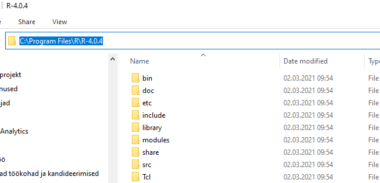
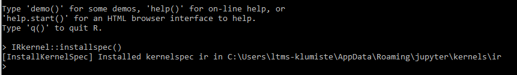

Kui Jupyter Anacondaga koos paigaldada, siis tuleb Anacondas kaasa oma R (vaikimisi versioon 3.6). See aga tähendab, et kõik paketid on vaja uuesti paigaldada, sest Anaconda-R asub mujal kui sinu arvutisse varem paigaldatud R. Kui sul oma arvuti RStudios kõik töötab aga Jupyteris ei tööta, siis võta ette järgmised sammud (kui üks variant ei tööta, siis proovi järgmist):

## Samm nr 1

Esimese sammu tegemiseks on mitu varianti. Alusta esimesest ja kui see ei tööta, siis proovi järgmist. Kui saad vastuse stiilis

> package ‘IRkernel’ successfully unpacked and MD5 sums checked

Siis võid edasi minna sammu 2 juurde.

### Variant 1

Käivita RStudios järgmine käsk:
```{r eval = FALSE}
install.packages('IRkernel')
```


### Variant 2

Käivita RStudios järgmised käsud:
```{r eval = FALSE}
# Kui pakett 'devtools' on puudu
install.packages("devtools")

devtools::install_github("IRkernel/IRkernel")
```

## Variant 3

See on ainlt Windowsi kasutajatele. Muude operatsioonisüsteemidega loodan kellegi abile.

1. Lae alla ja paigalda [RTools](https://cran.r-project.org/bin/windows/Rtools/). Kui oled varem juba paigaldanud, siis jäta vahele.
1. Lae alla [IRkernel zip-fail](https://github.com/IRkernel/IRkernel/archive/master.zip) Githubist.
1. RStudios käivita käsud (NB! Sea töökaustaks asukoht, kuhu laadisid .zip faili)
```{r eval = FALSE}
# Sea töökaustaks asukoht, kuhu laadisid .zip faili
setwd("C:/Users/<kasutaja>/Downloads")

install.packages("IRkernel-master.zip", repos = NULL)
```


Loodetavasti üks neist variantidest töötas. 


## Samm nr 2

Tee kindlaks kuhu kausta oled paigaldanud R-i. Näiteks




Seejärel käivita Anaconda:

1. Mine Anacondas `Environments`, käivita oma keskkond, kus jookseb ka R (Kodutööde juhendis panime nimeks `AndeteadusR`).
1. Vajuta rohelisele kolmnurgale ja vali `Open Terminal`.
1. Trüki sisse käsk `cd` ja oma Ri asukoht. Näiteks `cd "C:\Program Files\R\R-4.0.4\"`
1. Käivita käsk `cd bin` ja seejärel `R.exe`
1. Selle peale peaks tulema tuttav R-i teavitustekst. Käivita käsk `IRkernel::installspec()`. Tulemuse peaks olema midagi sarnast:



> Kui see ei õnnestu (saad veateate stiilis `failed to create process`), siis käivita Anaconda administraatori õigustega (_Run as Administrator_) ning proovi uuesti.


Käivita Jupyter (kui oli varem lahti, siis taaskäivita). Ava mõni Jupyter notebook või tee lihtsalt tühi notebook (R kerneliga) ja käivita käsk `R.Version()$version.string`. Kontrolli, kas see on seesama R, mis RStudios (`Tools -> Global Options -> R version`). 


Võid veel testida, et proovi käivitada Jupyteris mõni pakett mida sul kindlasti ei ole, nt. `library(pack)`. Vastuseks peaksid saama `Error in library(abd) : there is no package called ‘pack’` ja see peabki nii olema. Siis mine RStudiosse ja jooksuta `install.packages('pack')`. Eduka paigalduse järgselt proovi Jupyteris uuesti antud paketti sisse lugeda ja seekord peaks see õnnestuma.
