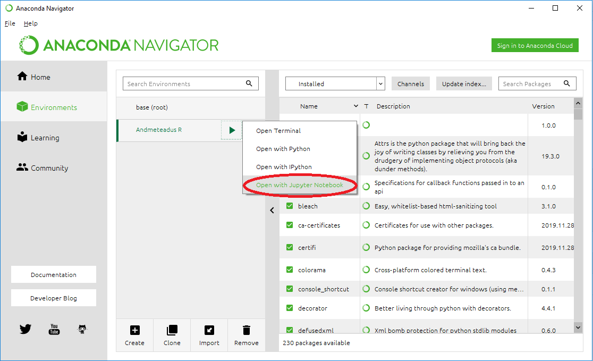

# Eeltöö

Kodutööde esitamiseks kasutame Jupyter Notebooki. Jupyteri paigaldamiseks ja jooksutamiseks vaata palun järgnevat videot [Jupyter Notebook Tutorial](https://www.youtube.com/watch?v=HW29067qVWk), et saada aimu, milleks Jupyteri kasutatakse. 

**NB! Anacondas R-i keskkonna käivitamiseks tekita uus keskkond.**

Jupyteri käivitamiseks:

Paljusid probleeme aitab ära hoida kui seadistada nii, et Jupyter ja RStudio kasutavad sama R-i (Anaconda keskkonnas see vaikimisi nii ei ole, ta tuleb oma R-iga). Seega kui edaspidi paigaldate paketi RStudios, siis on see ka Jupyteris olemas. Seadistamiseks järgi [juhiseid](../praktikum1_r_kernel).

**Kodutöö esitamiseks lae alla [Jupyter Notebook fail ja abifail](../kodutood/kodutoo1.ipynb).**

# I osa - veebiloengud, videod, artiklid (5 punkti)
1. (**2 punkti**) Vaata Johns Hopkinsi reprodutseeritava analüüsi videosid:

* [Reproducible Research: Concepts and Ideas (Part 1/3)](https://www.youtube.com/watch?v=4rBX6r5emgQ&index=1&list=PLjTlxb-wKvXOU4WW4p3qc4VKWTI4gLNUf)
* [Reproducible Research: Concepts and Ideas (Part 2/3)](https://www.youtube.com/watch?v=GXSRP--d3Q4&index=2&list=PLjTlxb-wKvXOU4WW4p3qc4VKWTI4gLNUf)
* [Reproducible Research: Concepts and Ideas (Part 3/3)](https://www.youtube.com/watch?v=bwQWhZQmDuc&list=PLjTlxb-wKvXOU4WW4p3qc4VKWTI4gLNUf&index=3)

Vasta järgmistele küsimustele:

* Selgitage, mida tähendab, et *reprodutseeritav analüüs* on kompromiss *uuringu replikeerimise* ja *mitte millegi* vahel.
* Mis on sinu arvates reprodutseeritava analüüsi suurim väljakutse? Põhjenda. Kuidas sellega toime tulla?

2. (**1 punkt**) Vaata videot [Data Management Course: Sharing your data](https://www.youtube.com/watch?v=eUC7MweyyFA)

Vasta järgmisele küsimusele:

* Nimeta vähemalt 3 olulist aspekti seoses andmete talletamise ning andmehaldusega, millele videos viidati.

3. (**2 punkti**) Loe artiklit [Researchers Finally Replicated Reinhart-Rogoff, and There Are Serious Problems](https://seekingalpha.com/article/1345701-researchers-finally-replicated-reinhart-rogoff-and-there-are-serious-problems).

Artikkel kirjeldab majandusteadlaste Reinhart'i ja Rogoff'i 2010. aasta publikatsiooni *Growth in a Time of Debt* ning mis vigu riigivõla ja majanduskasvu uurimisel tehti. Järgmises praktikumis uurime sama andmestikku, mida käsitleti ka Reinhart'i ja Rogoff'i artiklis.

Vasta järgmistele küsimustele:

* Nimeta, mis oli Reinhart'i ja Rogoff'i artikli üks olulisemaid tulemusi.
* Millel põhines teadlaste Herndon'i, Ash'i ja Pollin'i kriitika majandusteadlaste Reinhart'i ja Rogoff'i teadusartiklile *Growth in a Time of Debt.* (nimeta 3 probleemi).

# II osa - andmete analüüs (20 punkti)
Lõpeta praktikumis alustatud [automaatse aktsiaturu ülevaate genereerimise ülesanded](../praktikum1_aktsiad).

Abimaterjalid:

* [knitr](../praktikum1_knitr)
* [dplyr](../praktikum1_dplyr)

Kui tunned ennast veel ebakindlalt *dplyr* paketi kasutamise osas, siis soovitame ühte järgnevatest:

* Lugeda juhendit [Introduction to dplyr](https://cran.rstudio.com/web/packages/dplyr/vignettes/dplyr.html)
* Vaadata videot https://www.youtube.com/watch?v=8SGif63VW6E&t=4m5s, kus Hadley Wickham, kes on *dplyr* paketi autor, õpetab *UseR 2014* konverentsil seda paketti
    * 4:05 - 8:25 sissejuhatus, ülevaade andmestikest
    * 8:25 - 27:45 funktsioonid `filter`, `select`, `arrange`, `mutate`
    * 27:45 - 35:40 funktsioonid `summarise`, `group_by`

# Mida on vaja esitada?

* I osa ja II osa tuleb esitada vastused [Jupyter Notebook faili](../kodutood/kodutoo1.ipynb). 
* II osa kohta tee andmeanalüüsi raport R-is, Rmarkdown keeles, ning väljasta raport (html või pdf formaadis), salvesta .png formaati (nt. [pdf2png.com](pdf2png.com) abil) ja lisa Jupyter fail. Lähtekood .Rmd failis kopeeri Jupyter Notebook faili.

**NB! Kodutöö esitamisel nimeta fail kujul `<matrikli nr>_<kodutöö versioon>.ipynb`** (nt. `A12345_1.ipynb`). Kui kodutööst esitad mitu varianti (nt. parandad hilisemas versioonis mõne varasema vea), siis lisa versiooni nr faili nimesse.

Täidetud Jupyter Notebook fail esitada [Moodle keskkonna](https://moodle.ut.ee/course/view.php?id=8013#section-1) kaudu.

