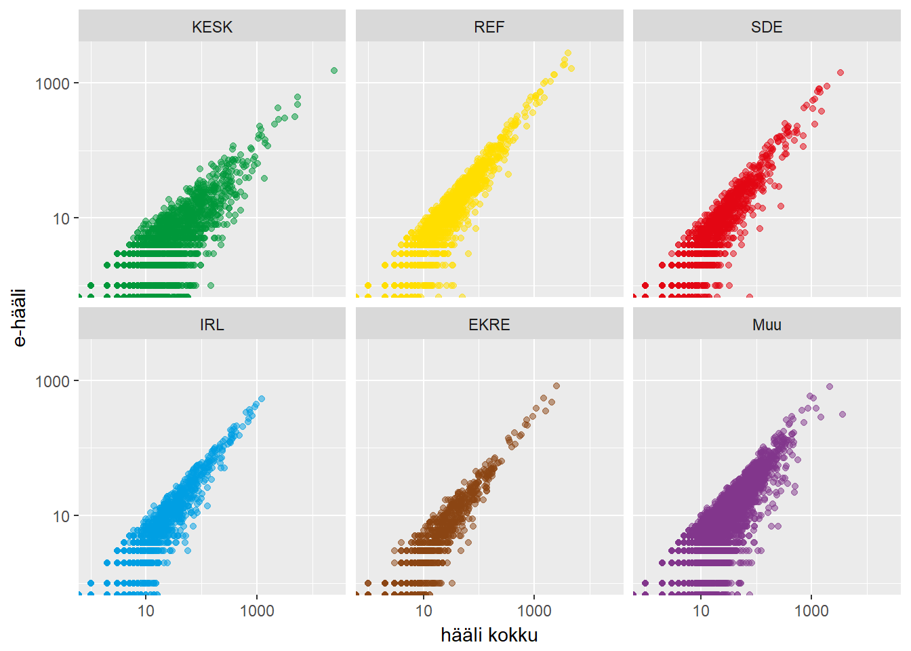
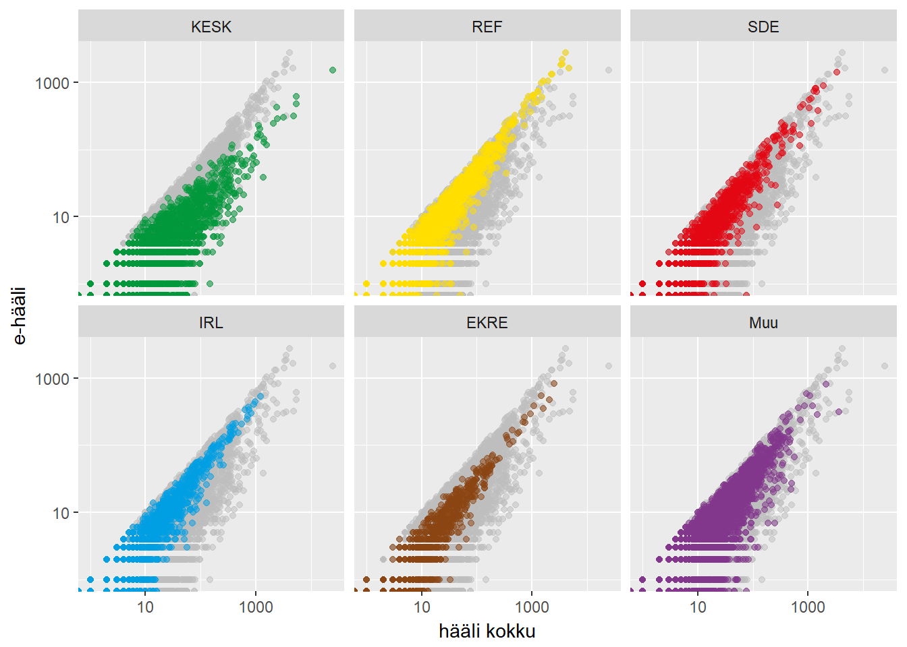

```{r, include = FALSE}
# See fail ei tee html faili päris sellisel kujul nagu vaja!

# Viimased joonised on välja võetud, muidu annaks siinset koodi githubist otse ümber kopida. 
```


## Sissejuhatus

Markus "Märul" Veekahuri isa on politseinik, ema on politseinik, mõlemad vanaemad on politseinikud ja õde on politseinik.
Algul vaadati viltuselt Markuse soovile ülikooli statistikat õppima minna, kuid pärast kahte kuud vaikimist vahetati telefoni teel esimene "tere" ning lepiti uuesti ära.

Kuid nagu elus ikka, ei kuku käbi kännust kaugele. Markus läks tööle Politsei- ja Piirivalveametisse ning tema igapäevatööks sai pettuste tuvastamine, kasutades statistilisi meetodeid.
Tema ametirelvaks on Benfordi seadus.

Benfordi seadus (sageli nimetatud kui esimese numbri seadus) kirjeldab arvu esimese numbri sagedust. Paljudes reaalsetes andmetes esineb number 1 esinumbrina umbes 30% juhtudest ning iga järgneva numbri sagedus kahaneb monotoonselt.


Empiiriliselt on näidatud, et Benfordi seadus kehtib näiteks aktsiahindade, jõgede pikkuse, riikide rahvaarvu andmetel. Järgneval joonisel on toodud kaks näidet Benfordi seaduse *kehtimisest*.

```{r, include=FALSE}
library(ggplot2)
library(gridExtra)
library(dplyr)
```


```{r, echo=FALSE}
df1 = data.frame(x=factor(c(1:9)),
                y=c(32.62, 16.66, 11.8, 9.26, 7.63, 6.55, 5.76, 5.14, 4.56))
p1 = ggplot(df1, aes(x=x, weight=y)) + geom_bar() + ggtitle("Twitteri kasutajaid jälgijate arvu lõikes \n") +
  scale_x_discrete("Esimene number") + scale_y_continuous("") + theme(text = element_text(size=11))

df1 = data.frame(x=factor(c(1:9)),
                y=c(31.57, 18.12, 11.88, 9.35, 7.84, 6.09, 5.78, 4.83, 4.53))
p2 = ggplot(df1, aes(x=x, weight=y)) + geom_bar() + ggtitle("Riikide SKP suurus \n") + 
  scale_x_discrete("Esimene number") + scale_y_continuous("") + theme(text = element_text(size=11))

grid.arrange(p1, p2, nrow=1)
```

Markuse ametivennad on järeldanud Benfordi seadusest kõrvalekaldumisest, et Kreeka on võltsinud makromajanduslikke näitajaid või et Iraani valimised olid ebaausad. Benfordi seadusest saad täpsemalt lugeda [Vikipeediast.](http://en.wikipedia.org/wiki/Benford%27s_law)

Selles kodutöös on sinu ülesandeks uurida: 

* kas Benfordi seaduse põhjal võib väita, et FIE-d on võltsinud maksunäitajaid, 
* kas Benfordi seaduse põhjal võib väita, et 2017. aasta kohaliku omavalitsuse volikogu valimistel toimus pettus.

Kuna ülesannetes on vaja teha *ggplot2* abil jooniseid, soovitame esmalt vaadata ära osa III videod *ggplot2* kohta. 

## Maksude andmestik

Loe sisse Maksu- ja Tolliameti 2014. aasta [maksude andmestik](../data/maksude_andmestik.csv) ja tutvu andmetega. Andmestikus on järgnevad tunnused:

* *registrikood*: juriidilise isiku registrikood
* *nimi*: juriidilise isiku nimi
* *liik*: kas tegemist on äriühingu, MTÜ, FIE vms
* *kaibemaksukohuslane*: kas juriidiline isik on käibemaksukohuslane
* *maakond*: millises maakonnas on juriidiline isik registreeritud
* *riiklikud_maksud*: käibemaks, tollimaks jne
* *toojoumaksud_ja_maksed*: sotsiaalmaks, töötuskindlustusmakse jne


### Ülesanne 1 (2 punkti)

Tee 3 joonist, mis iseloomustavad hästi seda andmestikku. Iga joonise juurde kirjuta üks lause, mida see joonis sinu arvates näitab.

```{r}
# sinu kood
```

### Ülesanne 2 (2 punkti) 

Kontrolli visuaalselt Benfordi seaduse kehtimist tunnustel *riiklikud_maksud* ja *toojoumaksud_ja_maksed*. Selleks tekita esinumbrite histogramm. Nulliga võrduvad väärtused jäta kõrvale. Tee vastav joonis ka FIE-de, äriühingute jne lõikes (vt tunnus *liik*).

Näpunäide: esimest numbrit aitab eraldada näiteks funktsioon `substr`.

```{r}
# sinu kood
```

Kommenteeri tulemusi. 

Kas sellest võib järeldada, et FIE-d jahmerdavad maksudega?


## 2017 KOV valimiste hääletustulemuste andmestik

Loe sisse [andmestik](../data/KOV_valimised_2017.csv) ja tutvu andmetega. Andmestikus on järgnevad tunnused:

* *nimi* - kandidaadi nimi
* *nr* - kandidaadi number
* *Maakond*
* *Omavalitsus*
* *Kood* - omavalitsuse kood
* *nimekiri* - partei või valimisliit, kuhu kandidaat kuulub
* *paberhaali* - kandidaadi poolt saadud paberhäälte arv
* *ehaali* - kandidaadi poolt saadud e-häälte arv
* *valitud* - kas kandidaat osutus valituks (*true*) või mitte (*false*)

### Ülesanne 3 (2 punkti)

* Esmalt tee juurde tunnus, mis näitab kandidaadile antud koguhäälte arvu (paberhäälte ja e-häälte summa). 
* Seejärel tekita tunnus, mille väärtusteks on *Eesti Keskerakond*, *Eesti Reformierakond*, *Sotsiaaldemokraatlik Erakond*, *Erakond Isamaa ja Res Publica Liit*, *Eesti Konservatiivne Rahvaerakond* ja *Muu*, st väiksemad erakonnad ja valimisliidud on ühte gruppi kokku võetud.
* Tee 3 joonist, mis iseloomustavad hästi seda andmestikku. Iga joonise juurde kirjuta üks lause, mida see joonis sinu arvates näitab.

```{r}
# sinu kood
```


```{r, include=FALSE}
andmed = read.table("../../data/KOV_valimised_2017.csv", sep=";", header=T)

```


### Ülesanne 4 (2 punkti)

Kontrolli visuaalselt Benfordi seaduse kehtimist: 

* e-häälte arvul,
* paberhäälte arvul,
* koguhäälte arvul.

Seejärel tee eelnevad joonised ka erakondade kaupa. Kommenteeri tulemusi.

```{r}
# sinu kood
```


### Ülesanne 5 (3 punkti) 

Tee järgnevale joonisele võimalikult sarnane. 



```{r, echo=FALSE, warning=FALSE, message=FALSE }
# Kood
```

Näpunäited:

* Log-skaala kasutamiseks uuri [järgmisi ggplot2 näiteid.](https://ggplot2.tidyverse.org/reference/scale_continuous.html)
* Legendi peitmiseks uuri [järgmisi ggplot2 näiteid.](https://ggplot2.tidyverse.org/reference/theme.html)  (märksõnaks on `legend.position`)
* Käsuga `facet_wrap` saab joonise jaotada tükkideks (Mõned [näited](https://ggplot2.tidyverse.org/reference/facet_wrap.html).)
* Et muuta värvid vastavaks erakonna sümboolikaga, kasuta värve "#00983A", "#FFDE00","#E30613", "#009FE3","#8B4513", "#82368C" (vastavalt KESK, REF, SDE, IRL, EKRE, Muu).
* Värvide muutmiseks uuri [järgmisi ggplot2 näiteid.](https://ggplot2.tidyverse.org/reference/scale_manual.html)
* Pööra tähelepanu n-ö akende pealkirjadele ja järjekorrale. Abiks võib olla funktsioon `factor`.


### Boonusülesanne 1 (2 punkti)

Lisa hallid mummud taustale. Tulemus peaks olema selline:



```{r, echo=FALSE, warning=FALSE, message=FALSE }
#Kood
```