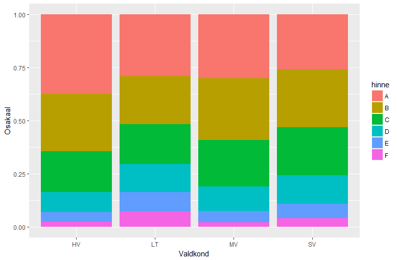
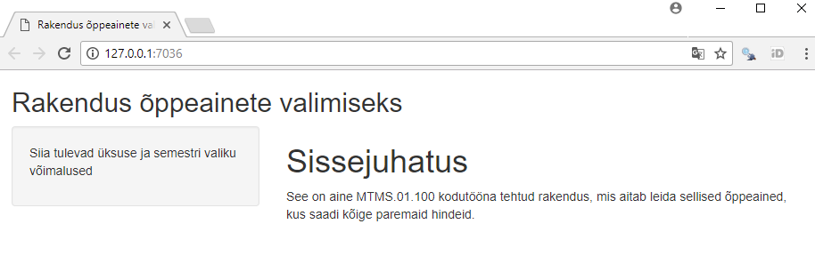
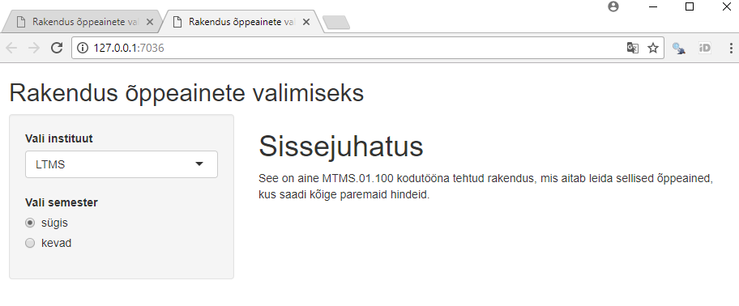
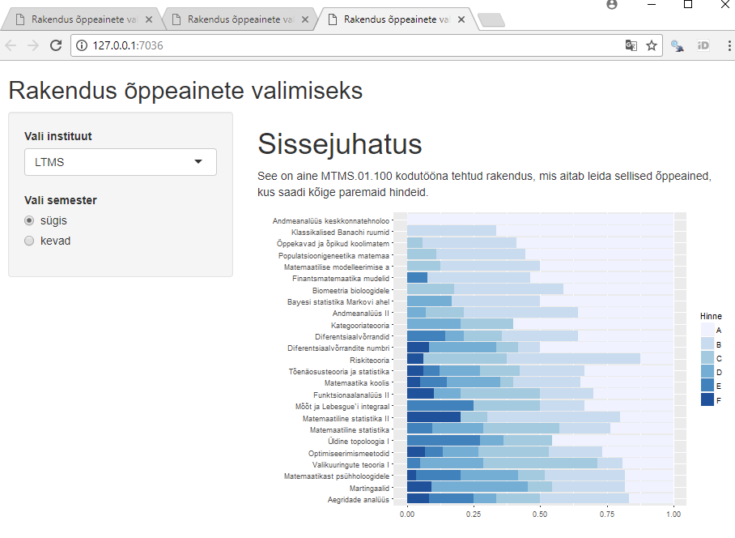

# Kuidas saada vähese vaevaga võimalikult häid hindeid?

### Sissejuhatus

See oli juba kolmas järjestikune öö, mil tudeng Keit "Ogar" Agarilt viis une õudusunenägu. "Te olite võrdsed kandidaadid, kuid parema keskmise hinde tõttu võtsime tööle teise kandidaadi," ütles OÜ Tunnetuslik Homöopaatia personalijuht. Töö sai Keiti alumine naaber, kes õpib 15. sajandi inglise kirjandust. Keit arvab, et seegi unenägu võib olla täideminev ning tal on vaja head vastuargumenti personalijuhile. Äkki on mõnes valdkonnas kergem paremat hinnet saada, mõtles Keit.

Ta teab, et finantsseisu parandamiseks ei saa lootma jääda vaid tööintervjuule. Mida teeks sellises olukorras tema ületee naaber, kes on saanud mitmeid EL toetusi ja sõidab kullatud istmesoojendusnupuga varustatud Mercedes-Benz maasturiga? Ilmselt uuriks, kuidas võimalikult vähese vaevaga parandada oma keskmist hinnet, et nii stipendiumit saada.

Kuna kolm plaani on ikka parem kui kaks, mõtles Keit, mida võtaks ette tema ettevõtlik tuttav, kes juhib alkoholilaenutuse ettevõtet. Pärast pingsat mõtlemist süttis Keiti peas lambike: ehk teeks ta abistava rakenduse kasvavale tudengipopulatsioonile, kelle eesmärk on võimalikult lihtsalt diplom kätte saada? 

Selles praktikumis uurimegi:

* millises valdkonnas/instituudis on kergem paremat hinnet saada?
* kas on aineid, milles on märgatavalt kergem paremat hinnet saada?
* kuidas teha veebirakendusi R-is?

### Tutvumine andmestikuga

*NB!* Antud andmestikke (UT_19_20_hinded.csv ja UT_19_20_tagasiside.csv) võib kasutada üksnes õppetöö eesmärgil, andmete kasutamine muul eesmärgil on keelatud!

Laadi alla andmestik [UT_19_20_hinded.csv](../data/UT_19_20_hinded.csv). Selles andmestikus on 2019/2020 õppeaasta kõigi TÜ  õppeainete kohta kirjas üliõpilaste õppetulemuste jaotus. Lisaks on teada 

* semester (S - sügis/K - kevad)
* valdkond (tunnus *AINE_VK*)
    * HV	humanitaarteaduste- ja kunstide valdkond
    * SV	sotsiaalteaduste valdkond
    * MV	meditsiiniteaduste valdkond
    * LT	loodus- ja täppisteaduste valdkond
* alamüksus, üldiselt instituut (tunnus *AINE_INST*)
* aine kood
* aine nimi
* õppeainele registreerunud üliõpilaste õppetulemuste jaotus 
    - eristava hindamisega ainete jaoks veerud *hinne_A*, ..., *hinne_F* ja *mitteilmunud*
    - mitteeristava hindamisega ainete jaoks veerud *arvestatud*, *mittearvestatud* ja *mitteilmunud*

### Ülesanne 1 (4 punkti)

Kas mõnes valdkonnas saavad üliõpilased paremaid hindeid kui mõnes teises? Kui palju erinevad hinded instituutide vahel (valdkondade lõikes)?  Kuidas seda visuaalselt kontrollida? Tee seda.

Märkus: Vaatle ainult **eristava hindamisega** aineid.

### Ülesanne 2 (4 punkti)

Kas mõnes õppeaines saavad üliõpilased paremaid hindeid kui mõnes teises? Millistes ainetes täpsemalt? Visualiseeri. 

Juhised:

* Vali välja sobiv joonisetüüp. Selleks võid kasutada mõnda eelmises ülesandes välja pakutud lahendust või pakkuda välja enda variandi. (Näiteks võid teha alloleva joonisega analoogilise joonise, ainult et valdkondade rollis oleksid õppeained)

* Vaatle väiksemat andmestikku, kus instituut (üksus) ja semester oleksid fikseeritud. Näiteks võid valida matemaatika ja statistika insituudi (LTMS) ning kevadsemestri.  
(Järgmises ülesandes tuleb koodi natuke modifitseerida, et rakenduse kasutaja saaks ise valida teda huvitava instituudi ja semestri.)
* Vaatle ainult selliseid eristava hindamisega aineid, millest võttis osa vähemalt 5 tudengit (st hinne on antud vähemalt 5 tudengile). 
* Leia iga õppeaine keskmine hinne. 
* Järjesta õppeained keskmise hinde põhjal. 
* Vali visualiseerimiseks välja TOP 25 ainet. 
* Praegu on õppeaine nimi selline faktor, mille tasemed on tähestikulises järjekorras. Aga ggplot2 joonise jaoks oleks hea, kui see oleks järjestatud keskmise hinde põhjal. (Näpunäide: kasuta funktsiooni `reorder`.)
* Tee joonis. 
* Juhul, kui kasutad mõnda tulpdiagrammi, võib horisontaalne esitus osutuda efektiivsemaks kui vertikaalne. Abiks on `coord_flip()`. 
* Kirjuta eelnev kood funktsiooniks, mille sisendiks sobiks selline andmestik nagu oli failis *UT_19_20_hinded.csv*. Lisaks oleks sisendiks üksus (*AINE_INST*) ja semester. Funktsioon peab tagastama ggplot2 joonise. Kontrolli, kas funktsioon töötab. 

```{r, eval=FALSE}
plot_oppeained = function(data, yksus, sem){
  # vali andmestikust data välja sellised read, 
  # kus uksus == yksus ja semester == sem
  
  # sinu kood
  
  # tagasta ggplot2 joonis
}
```


### Ülesanne 3 (17 punkti) - Rakenduse loomine

Alusta Shiny tutorialiga http://shiny.rstudio.com/tutorial/. Võimalusel on soovitatav läbi vaadata *Part 1* ja *Part 2* videod, kuid kodutöö sooritamiseks on piisav kasutada lehe lõpus olevaid *Shiny in seven lessons* materjale.

1. Tööta läbi *lesson 1*. Juhime tähelepanu järgnevale.
    - Kui sul ei tekkinud nuppu *Run App*, siis sulge RStudio ning ava uuesti. 
    - Paralleelselt alusta enda shiny rakenduse loomisega. Selleks tee enda kodutöö jaoks uus kaust ning salvesta sinna `app.R` (või `server.R` ja `ui.R`) näidisfail, mida hakkad edaspidi modifitseerima. 
    - Muuda enda rakenduse pealkiri vastavaks selle temaatikale. 
2. Tööta läbi *lesson 2*. Lisa peapaneeli:
    - esimese taseme pealkiri "Sissejuhatus"
    - tavalise tekstina lause, mis kirjeldaks lühidalt rakendust (näpunäide: vastav html termin on *paragraph*). 

Praeguseks võiks sinu rakendus välja näha umbes selline:


3. Tööta läbi *lesson 3*. 
    * Lisa valikukast, mille abil saab rakenduse kasutaja valida üksust (instituuti). 
    * Lisa nupp, mille abil saab kasutaja valida, kas teda huvitavad sügis- või kevadsemestri ained.
    
Praeguseks võiks sinu rakendus välja näha umbes selline:


4. Tööta läbi *lesson 4*. Uuri, kuidas kuvada erinevat tüüpi objekte.

5. Tutvu *lesson 5*-st muuhulgas sellega, millist osa `server.R` failist jooksutatakse ainult üks kord ning millist korduvalt. 
    * Lisa oma rakenduse kataloogi kasutatava andmestiku fail (näiteks kas `csv` või `RData` failina).
    * Loe see fail sisse, et kasutada seda rakenduses.
    
6. Kasuta nüüd ülesande 2 tulemusena valminud funktsiooni ning lisa joonis shiny väljundisse. Kutsu see funktsioon välja nii, et sisendid üksus ning semester vastaksid kasutaja poolt sisestatud väärtustele. 

Näpunäide: Joonise kuvamiseks tuleb kasutada funktsioone `plotOutput` ja `renderPlot`. (Kui soovid muuta joonise suurust, selleks on funktsioonil `renderPlot` argumendid `width` ja `height`.)

Praeguseks võiks rakendus välja näha umbes selline (sõltub, millise joonise tüübi ülesandes 2 valisid):


Et erinevate valdkondade joonised oleksid kohakuti (mõnedel ainetel on väga pikad nimed), võid aine nime asemel joonisel näidata aine nime algust (näiteks esimest *n* sümbolit, abiks on funktsioon `substr`). 

7. Täienda rakendust järgnevate lisadega:

  - Lisa slaider, mille abil saab kasutaja valida, mitut TOP ainet ta näha soovib. 
  - Lisa nupp, mille abil saab kasutaja valida, kas teda huvitavad kõige paremate õppetulemustega või hoopis kõige halvemate õppetulemustega ained (neid viimaseid oleks ju vaja vältida). 

Märkus: täienda seejuures funktsiooni `plot_oppeained()`:
```{r, eval=FALSE}
plot_oppeained = function(data, yksus, sem, mitu_ainet, parimad){
  # vali andmestikust data välja sellised read, 
  # kus uksus == yksus ja semester == sem
  
  # Filtreeri nii mitu ainet, kui suur on slaideri abil määratud 
  # parameetri mitu_ainet väärtus, 
  # seejuures vastavalt parameetri parimad valikule kas 
  # kõige kõrgema või kõige madalama keskmisega ained
  
  
  # tagasta ggplot2 joonis
}
```

Lõpptulemus võiks välja näha umbes selline:


Abiks on ka *Shiny Cheat Sheet* pdf, mis on kättesaadav [siit lehelt](http://www.rstudio.com/resources/cheatsheets/)


### Näiteid Shiny rakendustest:

* [BoxPlotR: a web-tool for generation of box plots](http://boxplot.tyerslab.com/). Väärib mainimist, et see rakendus avaldati teadusartiklina ajakirjas [*Nature Methods*](http://www.nature.com/nmeth/journal/v11/n2/full/nmeth.2811.html)
* [ClustVis: a web tool for visualizing clustering of multivariate data](http://biit.cs.ut.ee/clustvis/)
* [R Graph Catalog (ggplot2)](http://shinyapps.stat.ubc.ca/r-graph-catalog/)
* [Tartu Ülikooli statistika](https://statistika.ut.ee/ut/)


### Boonusülesanne 1: Interaktiivsus (**1 boonuspunkt**)

Kuva rakenduses oleva staatilise joonise asemel interaktiivne joonis. Kõige lihtsam viis joonistele interaktiivsuse lisamiseks on kasutada [plotly](https://plot.ly/r/) funktsionaalsust, kus olemasolevale ggplot objektile saab rakendada funktsiooni *ggplotly()*. Tulpdiagrammide korral võib selline lähenemine anda aga mõnikord vigaseid tulemusi. Nende korral on soovitatav katsetada [highcharter](http://jkunst.com/highcharter/) võimekust. 

Ülevaade interaktiivsete jooniste võimalustest ja edasised viited on leitavad [siit](http://www.htmlwidgets.org/showcase_highcharts.html).    

### Boonusülesanne 2: Kuidas optimeerida õppeaine tagasisidet?

Õppejõud Peeter "Bijektsioon" Ratsionaalil kästi õppeaine ümber korraldada. Tema õpetatavate ainete tagasiside on siiani olnud kehv, kuid ta on veendunud, et see pole mitte viletsa õpetamise ja halva ainekorralduse tõttu, vaid et üliõpilased annavadki paremat tagasisidet sellistele ainetele, kus eriti midagi tegema ei pea ning kus saab vähese vaevaga häid hindeid. 

Uuri, kas Peetri väited peavad paika. See tähendab, et kas tõepoolest on tal lootust saada ainele paremat tagasisidet, kui selle töömaht on väiksem, kui ette nähtud, ning kui tudengitele panna paremaid hindeid. 

Laadi alla andmestik [UT_19_20_tagasiside.csv](../data/UT_19_20_tagasiside.csv). (Praktikumis kasutatud andmestik oli selle alamandmestik.) Siin on toodud 2019/2020 õppeaasta kõigi TÜ õppeainete kohta (st nii eristava kui ka mitteeristava hindamisega):

* semester (S - sügis/K - kevad)
* valdkond (tunnus *AINE_VK*)
    * HV	humanitaarteaduste- ja kunstide valdkond
    * SV	sotsiaalteaduste valdkond
    * MV	meditsiiniteaduste valdkond
    * LT	loodus- ja täppisteaduste valdkond
* alamüksus, üldiselt instituut (tunnus *AINE_INST*)
* aine kood
* aine nimi
* õppeaine töömahtu puudutava tagasiside küsimuse vastuste jaotus
    - *toomaht_0* - Ei kehti
    - *toomaht_1* - aine töömaht oli liiga suur
    - *toomaht_2* - aine töömaht oli paras
    - *toomaht_3* - aine töömaht oli liiga väike
* tagasiside küsimuse "Kokkuvõttes oli õppeaine minu jaoks väärtuslik." tulemuste jaotus
    - *vaartus_0* - Ei kehti
    - *vaartus_1* - Ei nõustu
    - *vaartus_2* - Pigem ei nõustu
    - *vaartus_3* - Pigem nõustun
    - *vaartus_4* - Nõustun
* õppeainele registreerunud üliõpilaste õppetulemuste jaotus 
    - eristava hindamisega ainete jaoks veerud *hinne_A*, ..., *hinne_F* ja *mitteilmunud*
    - mitteeristava hindamisega ainete jaoks veerud *arvestatud*, *mittearvestatud* ja *mitteilmunud*

Ülesanded:

a. (**2 boonuspunkti**) Uuri, kas õppeaine tagasiside skoor üleüldse sõltub aine töömahust, ning kas ette nähtust väiksem töömaht tagab ainele parema tagasiside. Visualiseeri. 

b. (**2 boonuspunkti**) Uuri, kas õppeainele antud tagasiside üleüldse sõltub tudengite õppetulemustest seal aines, ning milline see sõltuvus on. Visualiseeri. 

### Boonusülesanne 3 (**2 boonuspunkti**)

Esita kogu kodutöö *Shiny Dashboard*'i abil, kus ülesanne 1, ülesanne 3 ja soovi korral boonusülesanne 2 on eraldi tabide (*menuItem()*) all. Töötava lahenduse korral ei ole vaja esitada hmtl ja Rmd faile ega ülesande 3 Shiny rakenduse faile, st kogu kodutöö on vormistatud *dashboard*'i abil

Juhis, kuidas ehitada *Shiny Dashboard*'i, on leitav [siit](https://rstudio.github.io/shinydashboard/get_started.html).
