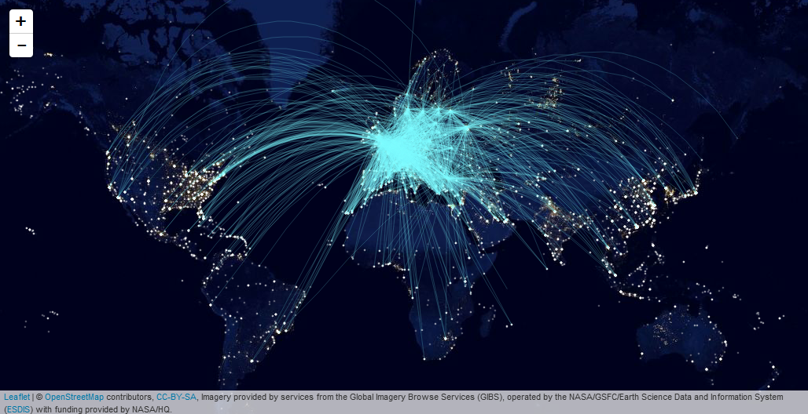

Paul Butler oli 2010. aasta lõpus Facebookis praktikal. Ta visualiseeris sotsiaalvõrgustiku andmeid tõmmates jooni sõprade asukohtade vahel.

```{r setup, include=FALSE}
knitr::opts_chunk$set(echo = TRUE, warning = FALSE, message = FALSE)
library(leaflet)
library(ggmap)
```


Joonis on atraktiivne ja annab hästi edasi FB visiooni. Seda sama joonist näidatakse igapäevaselt FB kontoris hiigelsuurelt ekraanilt ja kasutati näiteks FB aktsiaemissiooni prospektis, et meelde tuletada või selgitada ettevõtte missiooni. Paul tegi selle joonise [kasutades R-i.](http://paulbutler.org/archives/visualizing-facebook-friends/) Kuna FB meile andmeid ei andnud, vaatame selles kodutöös, kuidas lennuliiklus ühendab maailma.

### Tutvumine andmestikuga

Laadi alla andmestikud [airports.csv](../data/airports.csv) ja [flights.csv](../data/flights.csv) ning loe need töökeskkonda.

Andmestikus *airports.csv* on informatsioon lennujaamade kohta. Selles on järgnevad tunnused:

* *id* - lennujaama id
* *name* - lennujaama nimi
* *city* - millises linnas asub lennujaam
* *country* - millises riigis asub lennujaam
* *lat* - lennujaama asukoha laiuskraad
* *lon* - lennujaama asukoha pikkuskraad

Andmestik *flights.csv* sisaldab infot lendude kohta. Selles on järgnevad tunnused:

* *airline* - lennukompanii lühend
* *airline_id* - lennukompanii id
* *source_airport* - lähtekoha lennujaama lühend
* *source_airport_id* - lähtekoha lennujaama id
* *dest_airport* - sihtkoha lennujaama lühend
* *dest_airport_id* - sithkoha lennujaama id

### Suurringjoon

Paul Butler kasutas suurringjooni, et visualiseerida ühendusi sõprade vahel. Kahe punkti lühim vahemaa keral avaldub [suurringjoone](http://en.wikipedia.org/wiki/Great_circle) kaudu. Kui tuult ja muid sarnaseid tegureid mitte arvestada, lendavad lennukid pikki vahemaid suurringjoonte marsruutide kaudu.

Järgneval joonisel on see tähistatud punase joonega.


### Näide1: suurringjoon R-is

Näide, kuidas joonistada suurringjoont R-is. Ühendame Delta maja Facebooki peakontoriga kasutades baasgraafika võimalusi.

```{r, message=FALSE}
library(maps)
library(geosphere)

map("world", col="#f2f2f2", fill=TRUE, border=NA)

lat_delta = 58.385582 
lon_delta = 26.725512
lat_fb = 37.485245
lon_fb = -122.148807

gc_points = gcIntermediate(c(lon_delta, lat_delta), 
                           c(lon_fb, lat_fb), 
                           n=50, addStartEnd=TRUE)
lines(gc_points)
```


### Näide2: suurringjoon R-is

Näide, kuidas joonistada suurringjoont R-is. Ühendame Delta maja maailma suurima pitsa sünnikohaga kahutades `leaflet` paketti. Loe rohkem `leaflet`'i kohta [siit.](https://rstudio.github.io/leaflet/)


```{r, message=FALSE}
lat_delta = 58.385582 
lon_delta = 26.725512
lat_pitsa = 41.535158
lon_pitsa = 12.306798

library(leaflet)
library(geosphere)

m = leaflet() #koordinaatsüsteemis sisse lugemine

m = addTiles(m) #kaardikihtide lisamine

#suurringjoone punktid
gc_points = gcIntermediate(c(lon_delta, lat_delta), 
                           c(lon_pitsa, lat_pitsa), 
                           n = 50, addStartEnd = TRUE)
gc = data.frame(gc_points)

m = m %>% #punktide lisamine kaardile
  addCircles(lng = lon_delta,lat = lat_delta,color = 'red',weight = 3) %>%
  addCircles(lng = lon_pitsa,lat = lat_pitsa,color = 'red',weight = 3)

m = m %>% #joonte lisamine kaardile
  addPolylines(lng = gc$lon, lat = gc$lat, weight = 3, color = 'red')

m = m %>% 
  setView(lng = 0, lat = 50, zoom = 3) %>% 
  addProviderTiles("Esri.WorldImagery") #geoloogiline
m
```

### Ülesanne 2.1 (4 punkti)

Visualiseeri suurringjoonte abil ühendusi, kuhu saab Tallinna lennujaamast otselennuga. Võid kasutada vabalt valitud meetodit eelnevalt toodud näidete seast. 

Näpunäited:

* Kuna otselennuga saab Tallinnast vaid Euroopasse, siis kanna joonisele vaid Euroopa kaart.
* Tallinna lennujaama kood on 415 (mille võid leida, kui uurid andmestikust `airports` Eesti lennujaamu).
* Sihtkohtade lennujaamad leiad andmestikust *flights.csv*.
* Lennujaamade koordinaadid leiad andmestikus *airports.csv*.

```{r}
# sinu kood

```

### Ülesanne 2.2 (6 punkti)

Visualiseeri ühendusi, kuhu saab Tallinna lennujaamast otselennu või ühe vahepeatusega. Võid kasutada esimeses ning kolmandas näites tutvustatud võimalusi.

Näpunäited: 

* Et värve muuta läbipaistvaks, lisa värvikoodile lõppu läbipaistvuse intensiivsus. Näiteks kasuta funktsiooni `lines` korral argumenti `col="#00000010"`, et muuta mustade (värvikood #000000) joonte läbipaistvus 10%-ni või funktsiooni `addPolylines` korral argumente `weight=0.7` ja `opacity=0.3`.  

* Visualiseeri ühendusi Tallinn - vahelennujaam - lõpp-punkt. Tingimata pole tarvis mitu korda joonistada Tallinn - vahelennujaam ühendusi, need võid joonistada ka ühe korra.


```{r}
# sinu kood

```

Sinu joonis võiks tulla umbes selline:


või selline:



### Boonusülesanne B2.1 (1 punkt) - Juhuslik ekslemine eralennukiga

Alusta Tallinna lennujaamast. Vali kõikvõimalikest lennujaamadest juhuslikult üks ja lenda sinna. Vali nüüd juhuslikult järgmine sihtpunkt ning lenda sinna. Jätka seda protsessi 100 korral ja visualiseeri läbitud teekonda.

```{r}
# sinu kood
```


### Boonusülesanne B2.2 (2 punkti) - Juhuslik ekslemine kasutades kommertsliine

Alusta Tallinna lennujaamast. Vali võimalikest sihtkohtadest üks ja lenda sinna. Vali selle lennujaama võimalikest sihtkohtadest juhuslikult järgmine ning lenda sinna. Jätka seda protsessi 100 korral ja visualiseeri läbitud teekonda.

```{r}
# sinu kood
```
