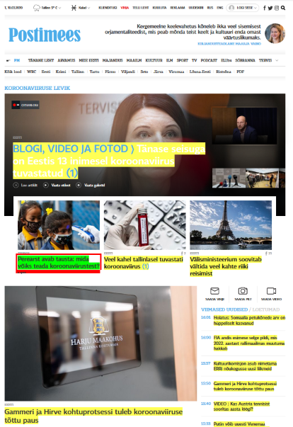

### Sissejuhatus

Eva "Usin" Masin on esimeses praktikumis kohatud Mati "Raha" Masina vastand. Talle meeldib rutiinsus, andmete tuim kopeerimine ja sisestamine. Vabal ajal meeldib talle lugeda romaanisarja "Tõde ja õigus" - eelmine nädal luges ta kokku tähekombinatsiooni "pa" esinemissageduse. Homme pärast tööd jätkab ta "pb" esinemissageduse leidmisega.

Õnneks oli eelnev tekst fiktsioon ja Eva-laadsed kopeerijad surid välja koos neandertaallastega. 
Selles praktikumis vaatame, kuidas R-is ellu äratada tehis-Eva, kes oskab veebilehtedelt automaatselt infot eraldada ja selle transformeerida struktureeritud andmestikuks. 

Täpsemalt, uurime

* kuidas eraldada Riigikogu hääletamistulemusi,
* kuidas eraldada Postimehe uudiste pealkirju,
* kuidas eraldada ilmajaama vaatlusandmeid,
* kuidas lotot mängides rikastuda?


Kaks esimest ülesannet õpetavad paketi *rvest* funktsionaalsust ja annavad sissejuhatuse veebikraapimisse minimalistlike veebilehtede põhjal.

### Ülesanne 1.1 (2 punkti) - CSS id

Eralda [html koodis](../examples/html1.html) sinisena olev tekst muutujasse `tekst`. Kasuta paketti *rvest*. 


* Vastava html koodiga saad mängida [siin](http://www.w3schools.com/html/tryit.asp?filename=tryhtml_css_id).

* Loe lühiülevaadet, millest koosnevad veebilehed ja uuri paketi *rvest* minimalistlikku näidet [siit](../praktikum5_rvest_minimal).

* Minimalistliku näite põhjal peaksid oskama eraldada lähtekoodis olevad 4 lõiku. Et eraldada lõik, kus id="p01", pead teadma, kuidas CSS-is tähistatakse id-sid.
Suur vihje on olemas eelneva html koodi < style > blokis. Abiks võib-olla ka [CSS selektorite interaktiivne testnäide](http://www.w3schools.com/cssref/trysel.asp).

* Uuri paketi [*rvest* dokumentatsiooni](http://cran.r-project.org/web/packages/rvest/rvest.pdf). Kasuks tulevad funktsioonid `read_html`, `html_node`, `html_nodes` ja `html_text`.

* Lõpptulemus peaks olema selline: `tekst = c("I am different.")`

```{r}
# Ülesanne 1.1
url = "https://andmeteadus.github.io/2021/examples/html1.html"

# sinu kood
```

* (**1 boonuspunkt**) CSS selektorite õppimiseks on tore tutorial http://flukeout.github.io/. Tee läbi esimesed 6 taset ja lisa vastused tekstina kodutöö raportisse.


<!--
```{r, eval=FALSE}
html_source = '<!DOCTYPE html>
<html>

<head>
<style>
p#p01 {
    color: blue;
}
</style>
</head>
<body>

<p>This is a paragraph.</p>
<p>This is a paragraph.</p>
<p>This is a paragraph.</p>
<p id="p01">I am different.</p>

</body>
</html>
'

# sinu kood

print(tekst)
```
-->

### Ülesanne 1.2 (2 punkti) - CSS class

Eralda [html koodis](../examples/html2.html) punaselt olev tekst muutujasse `tekst`. Kasuta paketti *rvest*. 


* Vastava html koodiga saad mängida [siin](http://www.w3schools.com/html/tryit.asp?filename=tryhtml_css_class).

* Lõpptulemuse peaks olema selline: `tekst = c("I am different.", "I am different too.")`

```{r}
# Ülesanne 1.2
url = "https://andmeteadus.github.io/2021/examples/html2.html"

# sinu kood
```


<!--
```{r, eval=FALSE}
html_source = '<!DOCTYPE html>
<html>

<head>
<style>
p.error {
    color:red;
}
</style>
</head>
<body>

<p>This is a paragraph.</p>
<p>This is a paragraph.</p>
<p class="error">I am different.</p>
<p>This is a paragraph.</p>
<p class="error">I am different too.</p>

</body>
</html>'

# sinu kood

print(tekst)
```
-->

### Ülesanne 1.3 (3 punkti)

>Margus "Maru" Rahvus on aus Eesti mees - ta aretab aias sini-must-valgeid ülaseid; mobiiltelefoni helinaks on tal "Eestlane olen ja eestlaseks jään" ja maksud on tal juba 3 aasta jagu ette ära makstud, et ikka kodumaa õitseks. Veebruaris 2021 oli ta pühaviha täis kui sai teada, et [Riigikogus lükkas tagasi eelnõu](https://www.riigikogu.ee/tegevus/tooulevaade/haaletused/haaletustulemused-kohalolekukontroll/905a7f22-99c0-4188-8bb6-0fe9125127a2), mis oleks ometi viinud ta lähemale Eesti Vabariigi presidendi otsevalimisteni. Juba aastaid on ta tahtnud valida selleks oma kalli naise Eevi "Emakaru" Rahvuse, et siis uhketel paraadidel ja ballidel kaasas käia, nautida esihärra head elu ja Kadriorus Pätsi pronksbüsti pead paitada.
>
>Margusel on plaanis kirjutada kiri kõikidele rahvasaadikutele, kes eelnõu vastu hääletasid, et pärida nende otsuse tagamaad. Ta pöördub Eva "Usin" Masina poole, kes on _copy-paste_ vallas kibe käpp.

Automatiseeri see protsess. Eralda ülal toodud Riigikogu hääletamistulemuste veebilehelt (lähtekoodi nägemiseks paremklikk ja Wiew Page Source), mitu saadikut hääletas Marguse ammuihaldatud eelnõu:

* poolt
* vastu
* oli erapooletu
* ei hääletanud

> Praktikumis tutvusime, kuidas brauseri veebiarenduse tööriistadega leida üles lähtekoodist vajalikud kohad. Variandid olid: 
> 
> * Chrome'is vajuta parem klikk ja "inspekteeri elementi". Alernatiivid on klahvikombinatsioon Ctrl + Shift + I või klahv F12. 
> * vahendiga [selectorgadget](http://selectorgadget.com/)
> 
> Need muudavad lähtekoodis õige klassi, id või sildi leidmise oluliselt lihtsamaks. Mõnes olukorras on kasulikum üks variant, mõnes teine. 

Vihjed:

* Väärtuste eraldamiseks kasuta atribuuti *href*. Uuri, kuidas eraldada atribuute CSS-i õppimise *tutorialist* http://flukeout.github.io/ (alates levelist 27).

* Kasutada paketi *readr* funktsiooni `parse_number()` kui sa ei taha regulaaravaldistega mässata. Vaata näiteks, mida teeb järgmine koodirida `"Kokku: 101 liiget" %>% parse_number()`

```{r}
# Ülesanne 1.3
url = "https://www.riigikogu.ee/tegevus/tooulevaade/haaletused/haaletustulemused-kohalolekukontroll/905a7f22-99c0-4188-8bb6-0fe9125127a2"

# sinu kood

```


### Ülesanne 1.4 (3 punkti)

Eralda eelnõu hääletamistulemuste andmetabel, kus on 101 rida ja tunnused *Nimi*, *Otsus* ja *Fraktsioon*.

Vihjed: 

* kasuta funktsiooni `html_table`,
* tabelis veeru *Otsus* puhastamiseks saab kasutada näiteks paketi *stringr* funktsiooni `str_split_fixed()`. 


```{r}
# Ülesanne 1.4
 # sinu kood
  
```

### Ülesanne 1.5 (2 punkti)

Visualiseeri, kuidas jaotusid otsused fraktsioonide lõikes.

```{r}
# Ülesanne 1.5
 # sinu kood
  
```


### Ülesanne 1.6 (3 punkti)

> Eva "Usin" Masin töötab start-upis, mis lubab Eesti turule tuua unikaalse personaalse uudisterakenduse, mis filtreerib uudiseid vastavalt kasutaja soovidele. Eva "Usin" Masin pandi koostama andmebaasi Postimehe esilehe uudiste kohta. Eva teab, kuidas karjääriredelis ülespoole ronida: "Bossi käsu peale olgu uudiste pealkirjad võimalikult kiiresti olemas".

Automatiseeri seesama protsess. Tagasta kõik Postimehe esilehe uudiste pealkirjad (joonisel näidatud kollasega). 

* Ära kurvasta, kui sa ei saa absoluutselt kõiki pealkirju, 97% on praegu piisav.
* Kui sulle ei meeldi Postimehe veebilehe hiiglaslikku lähtekoodi inspekteerida brauseris vaikimisi olevate vahenditega, siis abiks on praktikumis tutvustatud tööriist [selectorgadget](http://selectorgadget.com/).
* Vaata, et sinu tagastatud pealkirjade hulgas poleks tühju sõnesid või arve.



```{r}
# Ülesanne 1.6
url = "http://www.postimees.ee/"

# sinu kood
```

### Ülesanne 1.7 (3 punkti)

> Eva "Usin" Masinal on suur huvi ilmaandmete vastu. Kümme minutit pärast iga täistundi märgib ta Ilmateenistuse vaatlusandmeid oma märkmikku, et hiljem analüüsi teha.

Automatiseeri seesama protsess. 

Juhised:

* Riigi Ilmateenistus pakub värskeid [ilmaandmeid XML faili kujul](http://www.ilmateenistus.ee/teenused/ilmainfo/eesti-vaatlusandmed-xml/).
* Meie tegeleme [Eesti vaatlusandmete XML failiga](http://www.ilmateenistus.ee/ilma_andmed/xml/observations.php).
* Saa XML failist kätte iga ilmajaama õhurõhk.
* Saa XML failist kätte iga ilmajaama tuule kiirus.
* Tee neist õhurõhu ja tuule kiiruse *scatterplot*.

Näpunäide:

* Uuri paketi [*rvest* minimalistlikku näidet info eraldamisest XML failist](../praktikum5_rvest_minimal/#xml).

```{r}
# Ülesanne 1.7
# sinu kood

```


### Ülesanne 1.8 (3 punkti)

> Eva "Usin" Masin on lotohuviline, aga ta pole aastaid Viking Lottoga võitnud. Ta arvab, et lototulemused pole päris juhuslikud ning lotos on võimalik statistiline eelis saada.
Seepärast märgib ta iga lotokolmapäev Viking Lotto loositud numbrid üles ja uurib, kas number kahtesid loositakse rohkem välja, kui juhus lubaks.

1) Õpeta tehis-Eva tegema seda sama.

* Eesti Loto veebilehel on toodud [statistika loositud pallide sagedusest](https://www.eestiloto.ee/osi/stats.do?lastDraws=250&gameCode=11&sort=frq0&action=searchNumbers).
* Eralda Vikinglotto põhinumbrite tabel, kus veergudes on tunnused *Number*, *Sagedus* ja *Sagedus protsentides*.
* selectorgadget võib sind siin alt vedada ning kergem on lähtekoodi inspekteerida brauseris olevate tööriistadega (Chrome's vajuta `Ctrl + Shift + I` või tee parem klikk ja vajuta inspekteeri elementi).
* Visualiseeri saadud andmetabelit. Tee näiteks tulpdiagramm, kus x-teljel on arvud 1-48 ning y-telg tähistab sagedust.

```{r}
# Ülesanne 1.8
# sinu kood

```


2) (**Boonusülesanne 1.2 (3 punkti)**) Viimase 250 loosiga on pall 35 tulnud 18 korral, pall 2 aga 43 korral. Uuri, kas on alust arvata, et Viking Lotto süsteem on kallutatud. Selleks mõtle välja, kuidas seda kontrollida (näiteks võid kasutada simulatsioonidel põhinevat lähenemist). Selgita lühidalt oma lähenemist ja raporteeri, millise tulemuse said. Visualiseeri saadud tulemust.


### Boonusülesanne 1.3 (5 punkti) - Kas kõik teed viivad Facebooki? (ehk juhuslik ekslemine veebilehtedel)

Alusta suvaliselt veebilehelt. Eralda kõik väljuvad lingid. Vali üks neist linkidest suvaliselt. Hüppa sellele lingile. Kui sellel leheküljel pole ühtegi väljuvat linki, mine tagasi. Kui väljuvaid linke on mitmeid, vali jälle välja suvaline ja hüppa sinna. Kui jõudsid Facebooki, on katse lõppenud. Korda seda protsessi mitu korda ja erinevate alglehtedega. Uuri, mitmel juhul jõudsid FBsse.

Näpunäide: Abiks on paketi rvest funktsioon `follow_link()`. 

<!--

### Boonusülesanne 2 - Facebooki API kasutamine

Kasuta paketti *Rfacebook* ning leia:

**(1 boonuspunkt)** Mis on olnud Tartu Ülikooli Facebooki lehe kõige populaarsem postitus? Mis on olnud matemaatika ja statistika intituudi Facebooki lehe kõige populaarsem postitus?

**(5 boonuspunkti :-))** Kasuta R-i, et uuendada oma staatust tekstiga 'Teen aine "Statistiline andmeteadus ja visualiseerimine" kodutööd. Väga põnev! :-)'. Abiks on käsk `updateStatus`.


Abistavad lingid:

* Kuidas autentida: http://thinktostart.com/analyzing-facebook-with-r/
* Rfacebook dokumentatsioon: http://cran.r-project.org/web/packages/Rfacebook/Rfacebook.pdf

--->
