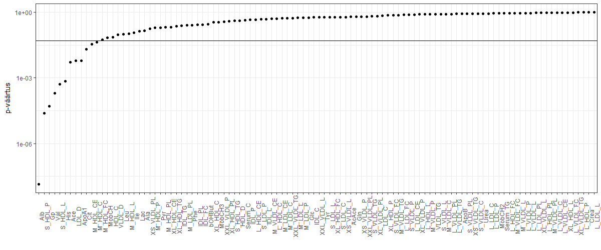

### Sissejuhatus

Geenitehnoloogiat tudeeriv Elo "Elu" Eliksiir on kuulnud, et ka geneetika valdkonnas leidub edukaid ettevõtteid, nagu näiteks 23andMe, mis annab inimesele teada tema riski haigestuda erinevatesse haigustesse. Sestap plaanib ta teha idufirma, mis teeniks tulu inimese surma prognoosimisega. Täpsemalt, inimeselt võetaks vereproov, ning selle tulemuste põhjal öeldaks talle, milline on tema tõenäosus surra järgneva 5 aasta jooksul. 

Et kirjutada taotlus rahastuse saamiseks, on tal esmalt vaja välja mõelda, millel see suremuse test üldse peaks põhinema. See tähendab, et millise ühendi sisaldust vereproovist oleks vaja mõõta? Ta leidis, et Geenivaramu teadlased eesotsas Krista Fischeriga (TÜ statistika professor) on 2014. aastal avaldanud teadusartikli [Biomarker Profiling by Nuclear Magnetic Resonance Spectroscopy for the Prediction of All-Cause Mortality: An Observational Study of 17,345 Persons](http://journals.plos.org/plosmedicine/article?id=10.1371/journal.pmed.1001606). 

Selle praktikumis uurimegi, kas ja kuidas saab biomarkerite abil ennustada surma. Meil on kasutada valim Geenivaramu andmestikust, mis sisaldab 5000 inimese verest mõõdetud 106 biomarkeri väärtuseid. 

Aga mis üleüldse on biomarker?

> A biomarker is a biological molecule found in blood, body fluids, or tissues that may signal an abnormal process, a condition, or a disease. The level of a particular biomarker may indicate a patient's risk of disease, or likely response to a treatment. For example, cholesterol levels are measured to assess the risk of heart disease.

Ehk et biomarkerid on lihtsalt märgid, mille seast mõned võivad midagi näidata.

### Andmestik

Kasutame valimit Geenivaramu andmestikust, mida kasutati eelnevalt mainitud teadusartikli juures. Täpsemalt on andmestikus tunnused:

* *sugu*
* *vanusegrupp*
* *s5* - indikaator, kas 5 aasta pärast oli surnud
* *hyp* - kas inimesel on hüpertooniatõbi ehk kõrgvererõhutõbi
* *suits* - kas on suitsetaja
* *LDL_D* - esimese biomarkeri väärtus
* *L_HDL_FC* - teise biomarkeri väärtus
* ...
* *Cit* - viimase biomarkeri väärtus

Lae alla andmestik [biomarkerid.csv](../data/biomarkerid.csv) ja loe töökeskkonda.

Analüüsi lihtsuse huvides eemalda puuduvaid andmeid sisaldavad read. Abiks on funktsioon `na.omit`. 

### Kui hästi on kolesterooli abil võimalik ennustada surma?

> Elo tutvus Geenivaramu andmestikuga, ent seal oli palju arusaamatute lühenditega biomarkereid. Samas on ta kuulnud, et kolesterool on üks nendest näitajatest, mille näit peab tingimata korras olema. Ehk saaks kolesterooli põhjal hästi prognoosida surma?

Eralda andmestikust alamandmestik, mis sisaldaks tunnuseid *sugu*, *vanusegrupp*, *s5*, *hyp*, *suits* ning  järgmisi biomarkereid:

1. Serum_C - üldkolesterool
2. HDL_C - [HDL kolesterool ("hea")](http://en.wikipedia.org/wiki/High-density_lipoprotein)
3. LDL_C - [LDL kolesterool ("halb")](http://en.wikipedia.org/wiki/Low-density_lipoprotein)

### Ülesanne 1.1 (2 punkti) - kolesterool soo ja vanusegruppide lõikes

Tutvu andmestikuga ja selgita välja, kuidas on kodeeritud tunnus sugu (kas 0 tähistab meest või naist)?

Visualiseeri, kuidas nende 3 biomarkeri jaotused erinevad soo ja vanusegruppide lõikes.

```{r}
# Ülesanne 1.1
# sinu kood

```

### Ülesanne 1.2 (4 punkti) - surma prognoosimine kolesterooli abil?

Uuri, kas kolesterool võimaldab prognoosida surma. Selleks tuleb andmetele sobitada mudel. 

a. Visualiseeri, kas kolesterooli (Serum_C, HDL_C, LDL_C) abil võiks saada prognoosida surma.  
```{r}
# Ülesanne 1.2a
# sinu kood

```
b. Tundub, et joonisest ei piisa ning tuleb pöörduda statistiliste mudelite juurde. Kas kasutad lineaarset või logistilist regressiooni? Miks? 

c. Kui sobitada mudel `glm(s5 ~ HDL_C, family=binomial, data=data)`, siis selgub, et HDL_C on oluline surma prognoosimisel. Kui aga sobitada mudel `glm(s5 ~ HDL_C + sugu, family=binomial, data=data)`, siis miskipärast HDL_C enam ei ole oluline. Hinda vastavad mudelid ja selgita, mis värk on. Kas siis kokkuvõttes HDL_C on oluline või mitte?
```{r}
# Ülesanne 1.2c
# sinu kood + kommentaar

```
d. Sobita kolm mudelit, et uurida kolesterooli seost surmaga (eraldi mudelid tunnuste Serum_C, HDL_C ja LDL_C jaoks). Muide, kas lisad mudelitesse ka tunnused sugu, vanusegrupp, suits ja hyp? Põhjenda oma otsust. 
```{r}
# Ülesanne 1.2d
# sinu kood + kommentaar

```
e. Milline on tulemus, st kas siis mõni kolmest kolesterooli tunnusest on olulise mõjuga surma ennustamisel? 


### Kogu andmestikul põhinev analüüs

Eelnimetatud teadusartiklis vaadeldi kõiki 106 biomarkerit. Tegelenud esialgu kolme biomarkeriga, saime tuttavaks logistilise regressiooniga R-is ning julgeme nüüd asuda artiklis kirjeldatud analüüsi reprodutseerima. Kõigis järgnevates ülesannetes kasutame kogu andmestikku (st kõiki 106 biomarkerit). 

### Ülesanne 1.3 (1 punkt) - korrelatsioonid biomarkerite vahel

* Tee joonis, mis annaks hästi edasi, kas ja millised biomarkerid on omavahel korreleeritud. (Näpunäide: Arvuta korrelatsioonimaatriks käsuga `cor` ning visualiseeri seda.) Interpreteeri, milliseid mustreid ja seoseid näed? 

```{r}
# Ülesanne 1.3
# sinu kood + kommentaar

```


### Ülesanne 1.4 (2 punkt) - Oluliste biomarkeri tuvastamine

Milline biomarker aitab kõige paremini ennustada surma kui võtame arvesse vanuse ja soo mõju?

Selleks sobita mudelid

* s5 ~ sugu + vanusegrupp + biomarker_1
* s5 ~ sugu + vanusegrupp + biomarker_2
* ...
* s5 ~ sugu + vanusegrupp + biomarker_106

ja iga biomarkeri korral eralda mudelist selle p-väärtus ja kordaja.

Ühele biomarkerile vastava kordaja ja p-väärtuse kättesaamiseks oleme ette andnud funktsiooni:

```{r, eval=FALSE}
biomarkeri_pvaartus_kordaja <- function(biomarker, formula0, andmestik){
  formula <-paste(formula0, biomarker, sep=" + ")
  mudel <- glm(formula, family = binomial, data = andmestik)
  summary_tabel <- coef(summary(mudel))
  pvaartus <- summary_tabel[nrow(summary_tabel), 4]
  kordaja <- summary_tabel[nrow(summary_tabel), 1]
  
  return(data.frame(biomarker = biomarker, 
                    pvaartus = pvaartus, 
                    kordaja = kordaja,
                    stringsAsFactors = FALSE))
}

formula0 <- "s5 ~ sugu + vanusegrupp"
biomarkeri_pvaartus_kordaja("LDL_D", formula0, data)
```


Käsitsi 106 korda antud funktsiooni läbi jooksutada ei tundu hea mõte olevat. Seega tuleks mudelite hindamisprotsess automatiseerida. Üks variant on kasutada `for` tsüklit. Teine võimalus on kasutada funktsiooni `lapply` (väljundiks list), mille esimeseks parameetriks on vektor väärtustega, mida etteantud funktsiooni (teine parameeter) esimeseks sisendiks määrata. Selle funktsiooni ülejäänud parameetrid saab määrata justkui need oleksid funktsiooni `lapply` parameetriteks.

a. Kirjuta funktsioon `biomarkerite_olulisus`, mis leiab nii kordaja kui p-väärtuse kõikidele biomarkeritele, mis funktsiooni ühe sisendina ette antakse. Kasuta selle funktsiooni sees funktsiooni `biomarkeri_pvaartus_kordaja`. Funktsiooni sisenditeks on
  - biomarkerid - vektor biomarkeritest, millele kordaja ja p-väärtus leida
  - formula0 - `gml` valemi osa, millele lisatakse veel juurde vaadeldav biomarker
  - andmestik - andmetabel, mille pealt mudelid hinnata 

```{r, eval=FALSE}
# Ülesanne 1.4a
biomarkerite_olulisus = function(biomarkerid, formula0, andmestik){
  
  # sinu kood
  
  # Tagastada dataframe, mille veergudeks on biomarkeri nimi, 
  # selle p-väärtus ning kordaja suurus
}
```

Kontrolli oma lahendust:

```{r, eval=FALSE}
f <- "s5 ~ sugu + vanusegrupp"
biomarkerite_olulisus(c("LDL_D", "HDL_C"), f, data)
```

Eelneva koodi jooksutamisel võiksid saada väljundiks:

```{r, echo=FALSE}
data.frame("biomarker" = c("LDL_D", "HDL_C"), 
           "pvaartus" = c(0.00593, 0.073287), 
           "kordaja" = c(0.2846, -0.17294))
```

b. Kasuta nüüd eelnevalt kirjutatud funktsiooni kõigi 106 biomarkeri jaoks. Prindi välja iga biomarkeri p-väärtus ning kordaja hinnang. 

```{r}
# Ülesanne 1.4b
# sinu kood

```


### Boonusülesanne 1.1 (2 punkti) - paralleelarvutus

Muuda funktsiooni `biomarkerite_olulisus` selliselt, et selle sees oleks kasutatud paralleelarvutust, st biomarkeritele vastavate mudelite hindamine oleks jaotatud protsessorituumade vahel. 

Selleks tuleks tavapärane `for` tsükkel või funktsioon `lapply` asendada näiteks funktsiooniga `parLapply` (pakett *parallel*) või funktsiooniga `foreach` ja operaatoriga `%dopar%` (pakett *foreach*). Vali neist välja meelepärasem või rakenda soovi korral mõnda muud paralleelarvutuste võimalust.  

Uuri, mida teevad järgmised näited:

```{r, eval = FALSE}
library(foreach)
library(doParallel)
tuumade_arv <- detectCores(logical = FALSE) # Füüsiliste tuumade arv
klaster <- makeCluster(tuumade_arv)
registerDoParallel(klaster)

foreach(i = letters[1:10], .combine = c) %dopar%
  toupper(i)

stopCluster(klaster)
```


```{r, eval = FALSE}
library(parallel)
tuumade_arv <- detectCores(logical = FALSE) # Füüsiliste tuumade arv
klaster <- makeCluster(tuumade_arv)

parLapply(klaster,letters[1:10], toupper)

stopCluster(klaster)
```

```{r}
# Ülesanne B1.1
# sinu kood

```

Kas paralleelarvutusega võitsid kiiruses?

**NB!** Kui erinevust ei tulnud, siis kasutad sa suure tõenäosusega MRO-d ([Microsoft R-Open](https://mran.microsoft.com/)), millel on paralleelarvutused (rohkemal või vähemal määral) vaikimisi sisse ehitatud. Võid antud ülesande ka MRO-ga teha - 

* Paigalda MRO 
* Muuda RStudios kasutatavat R-i (Tools -> Global Options -> R version)
* Jooksuta oma kood ülesande 1.4 kood uuesti ja esita siia tulemuste erinevused. 
* Mõõda erinevate R-de kasutamisel programmi käivitusaega, kasuta funktsiooni system.time({}):

```
system.time({ sleep_for_a_minute() })
#   user  system elapsed
#  0.004   0.000  60.051
```

### Ülesanne 1.5 (1 punkt)

Visualiseeri saadud tulemust. Võid teha näiteks sellise joonise p-väärtustest log-skaalal



```{r}
# Ülesanne 1.5
# sinu kood

```


### Ülesanne 1.6 (4 punkti + 1 boonuspunkt) - p-väärtuse piiri paikapanek

Nüüd saime kõigi biomarkerite jaoks teada p-väärtused. Jääb veel küsimus, millised neist peaksime liigitama olulisteks. 

Kuna testisime kõigi 106 biomarkeri olulisust surma ennustamisel, puutume kokku mitmese testimise probleemiga. Vaata selle kohta [koomiksit "Significant"](https://xkcd.com/882/) ning uuri [materjalist]( http://www.stat.berkeley.edu/~mgoldman/Section0402.pdf) mitmese testimise ja Bonferroni korrektsiooni kohta. 

a. (**1 punkt**) Selgita, milles seisnes koomiksi idee. 

Vastus: ...

b. (**1 punkt**) Artiklis kasutati olulisuse nivood `p < 0.0005`. Täpsemalt,

> ... significant at the Bonferroni-corrected threshold of p<0.0005, accounting for testing of 106 candidate biomarkers

Selgita, miks kasutati sellist p-väärtuse piiri (aga mitte klassikalist `p < 0.05`)?

Vastus: ....

c. (**2 punkti**) Veendumaks, et `p < 0.05` kasutamisel võime tõepoolest saada liiga palju valepositiivseid tulemusi, tekita andmestik, kus puudub seos tunnuse *s5* ja biomarkerite vahel. Selleks tekita uus tunnus, kus oleks *s5* väärtuseid permuteeritud suvaliselt. Sobita nüüd mudelid, kus prognoosiksid permuteeritud *s5* väärtuseid biomarkerite põhjal (selleks võid kasutada ülesandes 4 kirjutatud funktsiooni). 

* Mitme biomarkeri p-väärtused tulid väiksemad kui 0.05? 
* Aga mitu tükki olid olulised Bonferroni korrektsiooni järgi?
* Mitut olulist p-väärtust oleksid oodanud kummalgi juhul? Selgita. 

```{r}
# Ülesanne 1.6c
# sinu kood + kommentaar

```

d. (**1 boonuspunkt**) Korda permuteerimist 100 korral ning tee kokkuvõte tulemustest. 

```{r}
# Ülesanne B1.6d
# sinu kood + kommentaar

```


### Ülesanne 1.7 (1 punkt) - alternatiiv Bonferroni korrektsioonile

Ülesandes 3 nägime, et mitmed biomarkerid on omavahel tugevalt korreleeritud. Niisiis võib Bonferroni korrektsioon osutuda praegu liiga rangeks. Alternatiivselt võiksime leida, kui suur on meie andmestikus mittekorreleeritud tunnuste arv, ning teha nende arvu järgi Bonferroni korrektsiooni. Selleks, et leida andmestiku nn "efektiivne dimensionaalsus", kasuta PCA-d. 

Juhised:

* Rakenda andmestikul PCA-d ning leia, mitu peakomponenti seletavad näiteks 99\% variatsioonist. 
* Leitud peakomponentide arv näitabki ligikaudu sõltumatute tunnuste arvu meie andmestikus. Tee Bonferroni korrektsioon selle arvu järgi. Millise p-väärtuse piiri saad?

```{r}
# Ülesanne 1.7
# sinu kood + kommentaar

```


### Boonusülesanne 1.2 (2 punkti) - usaldusintervallid kordajate jaoks

a. (**1 boonuspunkt**) Muuda funktsiooni `biomarkeri_pvaartus_kordaja` selliselt, et iga biomarkeri kordajale arvutad ka 95% usaldusintervalli. Võid kasutada normaaljaotusel põhinevat lähendit ning arvutada selle `kordaja_hinnang +- 1.96 * SE`, kus SE on `summary(model)` väljundis toodud `Std. Error`. Funktsiooni tagastatavas andmetabelis peaksid nüüd olema ka veerud `UI_alumine` ja `UI_ylemine`. 

```{r}
# Ülesanne B1.2a
# sinu kood

```


b. (**1 boonuspunkt**) Visualiseeri tulemust (näiteks iga biomarkeri kohta näita kordaja hinnangut koos usaldusintervalliga). 

```{r}
# Ülesanne B1.2b
# sinu kood

```

### Ülesanne 1.8 (1 punkt) - forward selection

Artiklis on kirjeldatud mudeli koostamist järgnevalt: 

> For biomarker discovery in the Estonian Biobank cohort, a multivariate model was derived in a forward stepwise fashion (Figure 2). First, the biomarker leading to the smallest p-value in the model adjusted for age and sex only was included as a predictor. Subsequently, the biomarker leading to the smallest p-value in the multivariate model adjusted for age, sex, and the first biomarker was included in the prediction model. The process was repeated until no additional biomarkers were significant at the Bonferroni-corrected threshold of p<0.0005, accounting for testing of 106 candidate biomarkers.

Eelmistes ülesannetes leidsid kõige olulisema p-väärtusega biomarkeri. Jätka nüüd *forward selection*-iga:

* Lisa leitud biomarker mudelisse ning lähtu mudelist `s5 ~ sugu + vanusegrupp + kõige_olulisem_biomarker`
* Kasuta funktsiooni `biomarkerite_olulisus` ning leia nüüd järgmine biomarker, mis mudelisse lisada. 
* Jätka senikaua, kuni mudelisse lisatavad biomarkerite p-väärtused on väiksemad kui sinu määratud piir. 

Artiklis saadi sellise protsessi tulemusena 4 olulist biomarkerit: Alb, VLDL_D, Gp, Cit. Kas said samasugused? Kui kõiki ei saanud, ära muretse.

```{r}
# Ülesanne 1.8
# sinu kood

```

### Ülesanne 1.9 (1 punkt) - surma tõenäosuse prognoosimine

Eelmise ülesande tulemusena on sul nüüd olemas lõplik mudel, mis võtab arvesse kõik, mis on oluline surma tõenäosuse prognoosimiseks. Prognoosi iga andmestikus oleva inimese kohta tema tõenäosust surra 5 aasta jooksul ja visualiseeri tulemust (näiteks histogrammi abil).

Näpunäide: Uuri, mida teeb järgnev kood

```{r, eval=FALSE}
# Ülesanne 1.9
model = glm(s5 ~ suits + HDL_C, family=binomial, data=data)
newdata = data.frame(suits = c(0, 0, 1), 
                     HDL_C = c(0.5, -0.2, 1.1), 
                     suvaline_tunnus = c(1, 2, 3))
# On oluline, et newdata sisaldaks kindlasti kõik need veerud, mida on vaja prognoosimisel
predicted_probabilities = predict(model, newdata=newdata, type = "response")

# sinu kood
```


### Ülesanne 1.10 (2 punkti) - prognooside täpsus

Eelmises ülesandes prognoosisid surma tõenäosust. Aga mida hakkab tavainimene peale tõenäosusega? Olgem ikka konkreetsed, kas siis sureb 5 aasta jooksul või mitte. 

Selleks otsusta piir, millisest väiksemad tõenäosused klassifitseerid *ei sure* ja suuremad tõenäosused *sureb*. Kasutades seda piiri ning eelmises ülesandes kirjutatud funktsiooni, arvuta kõigi andmestikus olnud inimeste jaoks 5 aasta jooksul suremise prognoos (justkui meil poleks olnud teada tunnuse s5 väärtus). 

Milline on sinu prognooside täpsus (st kui suur osa prognoosidest langes kokku tunnuse s5 väärtusega)?

Võrdlusmomendi saamiseks paku välja veel mingi teine, naiivne klassifitseerija (see võib põhineda ükskõik kui lihtsal reeglil). Milline on selle täpsus?

```{r}
# Ülesanne 1.10
# sinu kood + kommentaar

```
