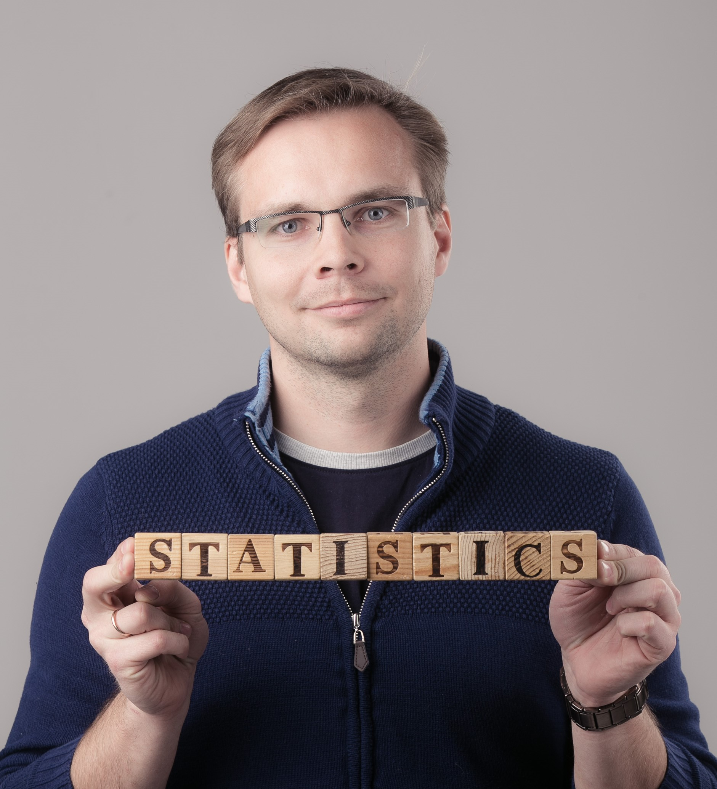

---
layout: frontpage
---

 

# Õppeaine lühikirjeldus

Tegemist on rakendusliku statistikakursusega, kus:

* Probleemipüstitusena kasutatakse huvitavaid päriselulisi andmestikke. 
* Rakendatakse sobivaid statistilisi meetodeid, et püstitatud küsimustele vastust leida. 
* Saadud tulemuste teistele kommunikeerimiseks illustreeritakse neid sobivate joonistega.

Järgnev skeem võtab lühidalt kokku õppeaine olemuse. 

# Õppeaine eesmärgid

* Tutvustada üliõpilastele, milliseid huvitavaid probleeme saab statistika abil lahendada erinevates valdkondades (näiteks bioteadustes, majanduses, juuras), ning harjutada nende lahendamist.
* Õppida visualiseerimismeetodeid andmetest ülevaate saamiseks, tulemuste tõlgendamiseks ja nende sisu edasi andmiseks.
* Tutvustada tarkvara R võimalusi reprodutseeritava analüüsi läbiviimiseks ning tulemuste visualiseerimiseks.

Miks on kursuses olulisel kohal andmeanalüüsi reprodutseeritavus ja visualiseerimine?

* **Reprodutseeritav analüüs:** 

  Kas enamik teadusartiklitest on valed?  

  Teadusajakirjas Nature on olnud palju juttu 
  [reprodutseeritavuse kriisist](http://www.nature.com/nature/focus/reproducibility/index.html): 
  publitseeritud analüüsitulemusi on raske taastekitada.  
  Tihti isegi siis, kui kasutatakse samu andmestikke
  (näiteks Harvardi majandusteadlaste [artikkel](http://en.wikipedia.org/wiki/Growth_in_a_Time_of_Debt), 
  mida käsitleme õppeaine raames).
  
* **Visualiseerimine:**

  Kõige parema ülevaate andmetest saab visualiseerimise abil ning sageli on joonised parimaks viisiks, kuidas statistik saab oma töö tulemusi teistele kommunikeerida. 
  
  > Tähtis on analüüsitulemuste kommunikeerimine ja müümine.  
  > *(Bank of America kvantitatiivne analüütik ja TÜ statistika vilistlane A. Sepp)*

# Sihtgrupp

Kursus on mõeldud statistikahuvilistele üliõpilastele, kes on tuttavad tarkvaraga R. Kui sa ei ole võtnud *rangelt soovituslikku* eeldusainet "Rakendustarkvara: R", aga soovid seda ainet õppida, siis soovitame iseseisvalt R-i õppida ["Rakendustarkvara: R" õppematerjalide](./rakendustarkvara_R) abil.

# Õppetöö korraldus

Õppeaines toimub kokku **9 praktikumi**. 
Kuna aines on kasutusel *pööratud klassiruumi* meetod, siis on loengute asemel ette nähtud iganädalane **iseseisev töö**. 
See võib sisaldada mõne artikliga tutvumist, veebiloengu vaatamist vms. 
Arutelu iseseisvalt õpitu kohta ning praktikumid toimuvad klassiruumis.

Lisaks praktikumidele sisaldab õppeaine järgnevaid komponente:

* **Kodutööd:** Kokku antakse 8 kodutööd (igaüks 25 punkti). 
  * Kodutöö sisaldab enamasti andmete analüüsimist, visualiseerimist jne. Iga kodutöö tulemuseks on [knitr](http://yihui.name/knitr/)-i raport koos R-i koodi ning kommentaaridega. 
  * Kodutöö võib sisaldada ka küsimusi iseseisvalt õpitu (näiteks videoloengu) kohta. 
  * Kodutööde esitamine käib läbi Moodle'i ja tähtaeg on 1 nädal. Kui kodutöö esitatakse pärast tähtaega, siis on võimalik seda esitada veel 1 nädala jooksul aga trahv -50% punktidest.
* **Projekt:** Lisaks tuleb läbi viia üks praktiline andmeanalüüs ning kirjutada populaarteaduslikus vormis artikkel saadud tulemustest. 
Artikkel on illustreeritud asjakohaste joonistega ning on arusaadav ka mittestatistikule. 
Projekti võib teha kas üksinda või paaristööna. Tulemusi on vaja esitleda suulisel kaitsmisel. Soovi korral võib tutvuda [2020.](https://andmeteadus.github.io/2020/projektid/) ja [2021.](https://andmeteadus.github.io/2021/projektid/) aasta projektidega.
 * Iga projekti esitanud tudeng(id) saavad ühe (juhusliku) kaastudengi(te) projekti retsenseerimiseks.

Aine läbimiseks on vaja:

1. kodutööde eest saada vähemalt 75% punktidest (on vaja saada vähemalt 150 punkti 200st võimalikust), 
2. koostada projekt ning seda esitleda. 
3. anda põhjalik tagasiside ühele kaastudengi(te) projektile.

Õppeaines (3 EAP) ette nähtud 78 tundi tööd jaguneb järgnevalt:

* praktikumid kokku 12 tundi (8 praktikumi, igaüks 1,5 tundi)
* kodutööd kokku 40 tundi (8 kodutööd, igaüks 5 tundi)
* projekti koostamine 22 tundi
* projekti esitlemine + retsenseerimine 2 tundi
* teiste esitluste kuulamine 2 tundi

# Tunniplaan

Õppeaine toimub 2021/2022. õppeaasta kevadsemestril. 

* **Praktikumid 1. rühmal esmaspäeviti kell 10:15 ruumis 2004 ja 2. rühmal teisipäeviti kell 14:15 ruumis 2030**.
* **Projekti tähtaeg: TBD**
* **Projektide ettekandmine: TBD**

# Kontakt ja küsimused

<!--

-->

Kaari Kuus ja Raul Niit  
kaari.kuus@ut.ee, raul.niit@ut.ee

<!-- Antud kursust toetab [DataCamp](https://www.datacamp.com/). Aines osalejatel on võimalus võtta kõiki DataCamp kursuseid tasuta. Kõigest täpsemalt esimeses praktikumis. -->
<!--   -->